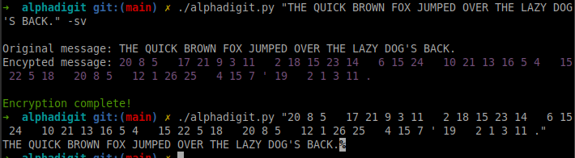
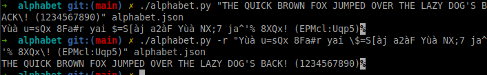

# **Ciphers**
A set of ciphers.

## **XOR Cipher**
```c
void xor_encrypt_decrypt(void *key, size_t key_length, void *data, size_t data_length)
                             <rdi>           <rsi>        <rdx>            <rcx>
```
An XOR cipher in assembly language.  
In cryptography, the simple XOR cipher is a type of additive cipher, an encryption algorithm that operates in binary according to the following principle:

```
   0 1 1
   0 1 0
   _____
=> 0 0 1
```

Encryption and decryption are done using the same algorithm.


## **XOR with Addition**
```c
void xor_with_additive_cipher(
    void *key, size_t key_length, void *data, size_t data_length)
         <rdi>           <rsi>         <rdx>           <rcx>
```
We’ve added an additive cipher to the previous XOR cipher:
```
- Encryption:
    1. <byte> + <additive cipher value>
    2. XOR <data-byte> <key-byte>

- Decryption:
    1. XOR <data-byte> <key-byte>
    2. <byte> - <additive cipher value>
```

## **Alphadigit**

### **Description**
A numbered alphabet cipher written in Python.  
- During encryption, it takes command-line arguments, converts each argument to a series of numbers representing the position of each character in the alphabet, and prints the results.  
- The reverse process is done during decryption.
- It can only decode numbers separated by spaces.
- Handled alphabetical characters include:  
- `a-z`, `Ç-Ü`, `á-Ñ`.  
- It also handles punctuation.
- Arguments can only contain either all digits or all letters, but not both. This is to avoid any confusion, as we have a numerical cipher.<br />
  - For instance, if we left the digits in the final output:
    - When encoding:<br />
    `1cm` => *encode* => `1 3 13`
    - When decoding:<br />
    `1 3 13` => *decode* => `ACM` != `1cm`

---
### **Commands**
```bash
# Usage
./alphadigit [option] [source],...

# option
-s: Use spaces between numbers in encryption mode’s output string.
-v: Verbose mode. Useful to disable when reusing the output through pipes, etc.
```
---
### **Screenshot**


(The inaugural message transmitted over the Moscow–Washington hotline on August 30, 1963, was the test phrase: `THE QUICK BROWN FOX JUMPED OVER THE LAZY DOG'S BACK 1234567890`, which is a [pangram](https://en.wikipedia.org/wiki/Pangram).)


## **HexToBase32**

### **Description**
A C++ function to convert a hexadecimal string to a Base32 string.


## **Morse Encoder**

### **Description**
A python Class to convert a string into Morse code, and vice versa, handling space and alphanumeric characters with a dictionary lookup.

### **Commands**
```bash
# Usage
morse_encoder.py [-h] [-r] string

# positional arguments:
  string         the text to convert

# options:
  -h, --help     show this help message and exit
  -r, --reverse  convert from Morse code to alphanumerical string

# Example:
./morse_encoder.py "THE QUICK BROWN FOX JUMPED OVER THE LAZY DOGS BACK 1234567890"
```
---
### **Screenshot**


## **Alphabet**

### **Description**

A simple substitution cipher that encodes texts according to a custom alphabet declared in `alphabet.json`.

- The program takes a string as an argument and encodes or decodes it according to our **custom alphabet**.

- By default, the custom alphabet supports **alphanumeric characters**, but you can add any character set you like.

- All unhandled characters will remain **unencoded** in the final output.

* Default alphabet:
```
    'A': 'X',
    'B': '8',
    'C': 'Q',
    'D': 'j',
    'E': 'à',
    'F': 'y',
    'G': '^',
    'H': 'ù',
    'I': 's',
    'J': '$',
    'K': 'x',
    'L': 'N',
    'M': 'S',
    ...
```
---
### **Commands**
```bash
# Usage
alphabet.py [-h] [-r] string_to_convert alphabet_dict

# positional arguments:
  string_to_convert  the text to convert
  alphabet_dict      JSON file containing the custom alphabet

# options:
  -h, --help     show this help message and exit
  -r, --reverse  convert an encoded text to the original text
```
---
### Screenshot



## Keygens

### **Description**
This folder contains key generators.

### **`time_based_rand_keygen.c`**
- Generates an encryption key randomly with two different functions
	using different precision of the current time as seed.

 - charset: a set of characters that can be used for the key
 - strength: the width of the key

- Setting the seed for the random number generator used by rand()
	helps ensuring that the sequence of random numbers generated by rand()
	is different each time the program runs.

- The seed is set according to the current time, which makes it unique, but
	not perfectly:

	- Using srand(time(NULL)) (like in the first function) seeds the random
		number generator with the current time in seconds.
	- This means that if you call srand(time(NULL)) multiple times within
   	the same second, you will get the same sequence of random numbers
 	because the seed value does not change.
 - Using clock_gettime(): This function (used in the second function) can
		provide nanosecond precision, depending on the clock used. This will
 	improve the randomness of the key.

### **`random_keygen.c`**

Using /dev/urandom or /dev/random is generally more secure and
	provides better randomness than using rand() with a time-based seed.

#### Advantages of Using /dev/xrandom:

	- Cryptographic Security: /dev/xrandom is designed to provide
		cryptographically secure random numbers. It uses environmental
		noise collected from device drivers and other sources to generate
 	random numbers, making it much harder to predict the output.

	- Non-Deterministic: Unlike rand(), which is a pseudo-random number
 	generator (PRNG) that produces a deterministic sequence based on
 	an initial seed, /dev/xrandom generates non-deterministic random
 	numbers. This means that even if you read from it multiple times
 	in quick succession, you will get different values.

	- Higher Entropy: The randomness quality (entropy) of numbers generated
 	from /dev/xrandom is significantly higher than that of rand().
   This makes it suitable for applications that require high-quality
 	randomness, such as cryptographic keys, secure tokens, and other
 	security-sensitive operations.


#### /dev/urandom or /dev/random:

- Blocking Behavior: /dev/random is a blocking source of random numbers.
This means that if there is not enough entropy (randomness) available
	in the system, reading from /dev/random will block (i.e., wait) until
	sufficient entropy is gathered.
This can lead to delays in applications that require random numbers.

- While it may not provide the same level of entropy as /dev/random,
	/dev/urandom is generally considered secure enough for most applications,
	including cryptographic purposes. 
