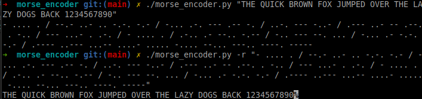

# **Ciphers**
A set of ciphers.

## **XOR Cipher**
```c
void xor_encrypt_decrypt(void *key, size_t key_length, void *data, size_t data_length)
                             <rdi>           <rsi>        <rdx>            <rcx>
```
An XOR cipher in assembly language.  
In cryptography, the simple XOR cipher is a type of additive cipher, an encryption algorithm that operates in binary according to the following principle:

```
   0 1 1
   0 1 0
   _____
=> 0 0 1
```

Encryption and decryption are done using the same algorithm.

## **XOR with Addition**
```c
void xor_with_additive_cipher(
    void *key, size_t key_length, void *data, size_t data_length)
         <rdi>           <rsi>         <rdx>           <rcx>
```
We’ve added an additive cipher to the previous XOR cipher:
```
- Encryption:
    1. <byte> + <additive cipher value>
    2. XOR <data-byte> <key-byte>

- Decryption:
    1. XOR <data-byte> <key-byte>
    2. <byte> - <additive cipher value>
```

## **NbrAlpha Cipher**

### **Description**
A numbered alphabet cipher written in Python.  
- During encryption, it takes command-line arguments, converts each argument to a series of numbers representing the position of each character in the alphabet, and prints the results.  
- The reverse process is done during decryption.

It can only decode numbers separated by spaces.  
Handled alphabetical characters include:  
- `a-z`, `Ç-Ü`, `á-Ñ`.  
- It also handles punctuation.

### **Commands**
```bash
// Usage
python3 nbralpha [option] [source],...

// option
-s: Use spaces between numbers in encryption mode’s output string.
-v: Verbose mode. Useful to disable when reusing the output through pipes, etc.
```

### **Screenshot**
<p>
   
</p>
From Edgar Allan Poe's short story "The Gold-Bug".

## **HexToBase32**

### **Description**
A C++ function to convert a hexadecimal string to a Base32 string.

## **Morse Encoder**

### **Description**
A python Class to convert a string into Morse code, and vice versa, handling space and alphanumeric characters with a dictionary lookup.


(Quote by Helen Keller)

## **Custom Alphabet Encoder**

### **Description**

A simple substitution cipher that encodes texts according to a custom alphabet declared in `alphabet.py`.

- The program takes a string as an argument and encodes or decodes it according to our custom alphabet.

- By default, the custom alphabet supports alphanumeric characters, but you can add any character set you like.

- All unhandled characters will remain unencoded in the final output.

* Default alphabet:
```
    'A': 'X',
    'B': '8',
    'C': 'Q',
    'D': 'j',
    'E': 'à',
    'F': 'y',
    'G': '^',
    'H': 'ù',
    'I': 's',
    'J': '$',
    'K': 'x',
    'L': 'N',
    'M': 'S',
    ...
```


